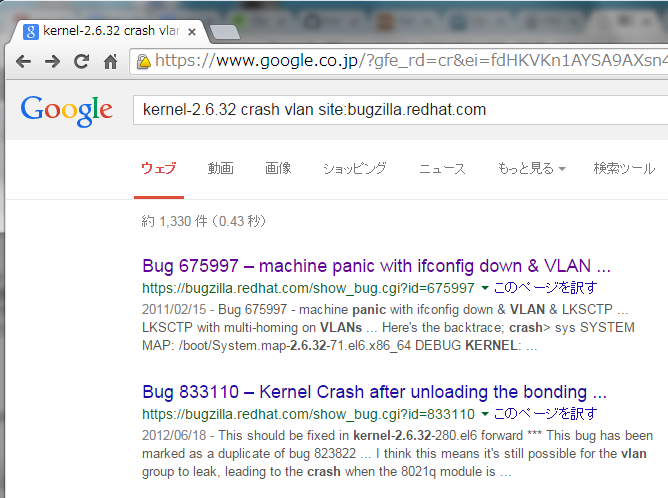
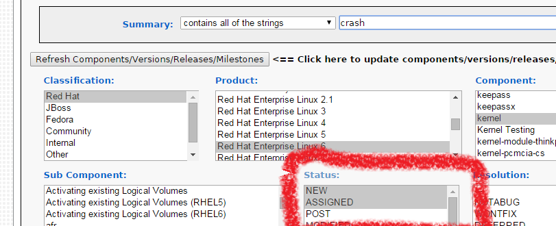
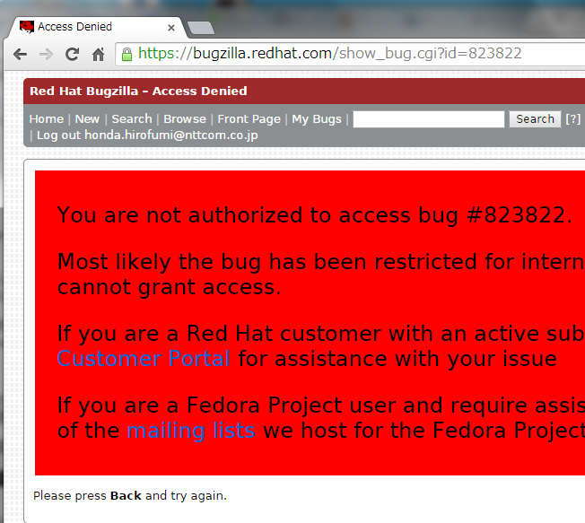
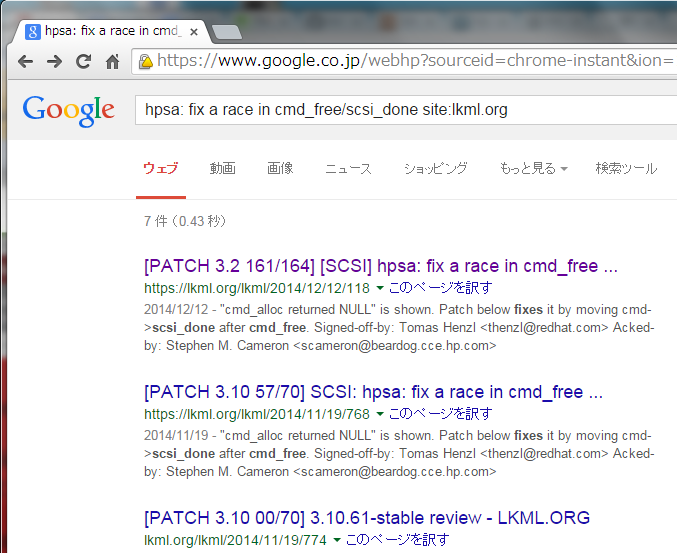

% 障害解析について
% 本多浩文
% 2015/01/30

# はじめに
## 自己紹介

- 担当業務
  - 主にC言語で書かれたOSSの機能調査、障害解析

## 今日のお題
- 障害解析のための検索の使い方

# Web検索の使い方

## 良くない検索方法

## 何が良くないのか
- 問題の特徴が絞り込めていない
- 信頼出来ない(情報が古い等)情報が多数含まれる

## より良い検索結果

## 何がちがうのか
- 対象パッケージを絞りこんでいる(kernel-2.6.32)
- 問題が発生したモジュールを特定している(vlan)
- 信頼性の高い情報があるサイトを使っている(site:bugzilla.redhat.com)

# 検索キーワードを探す

## ログの内容を確認する

ログの変数部分とそうでない所を区別する。

~~~~~~~~
Jul 21 13:00:37 localhost kernel: IPMI message handler: BMC returned \
incorrect response, expected netfn 2d cmd 0, got netfn 5 cmd 12
~~~~~~~~~
"2d","0","5","12" は変数。

- 変数は除外して検索すると、うまく情報を得られる場合がある

## 何がログを出力しているのか？

~~~~~~~~~
[#|2012-07-05T15:10:54.628-0600|WARNING|glassfish3.1.2\
|com.sun.grizzly.config.GrizzlyServiceListener|\
_ThreadID=11;_ThreadName=Thread-2;|GRIZZLY0006: Exception accepting channel
java.io.IOException: Too many open files
~~~~~~~~~

java の IOException が出力されているが、実は"Too many open files"を出力しているのは、glibcのstrerror(3)という関数。

## エラー番号とメッセージの対応

/usr/include/asm-generic/errno-base.h を見ると…

~~~~~~~~
#define EMFILE          24      /* Too many open files */
~~~~~~~~

EMFILE というエラーが発生していることが分かる。
エラー番号だけを拾って以下のようなログになっていることも。

~~~~~~~~
errno=24
~~~~~~~~

/usr/include/asm-generic/errno.h も要参照。

# 既知の事象を確認する

## 修正済みの問題を確認
- 最新パッケージをダウンロードして、変更履歴から検索する。以下は hpsa モジュールの履歴を抜き出した例。

~~~~~~~~~~~~~~~~~
# yum install yum-downloadonly
# yum --downloadonly --downloaddir=/tmp install kernel
# rpm -q -p /tmp/kernel*.rpm --changelog|egrep '(^\*|hpsa)'
(略)
* 月  9月 23 2013 Rafael Aquini <aquini@redhat.com> [2.6.32-420.el6]
- [block] hpsa: remove unused Smart Array ID (Tomas Henzl) [1002788]
- [block] hpsa: bump driver version to reflect changes (Tomas Henzl) [1002788]
- [block] hpsa: housekeeping patch for device_id and product arrays (Tomas Henzl) [1002788]
- [block] hpsa: add HP Smart Array Gen8 names (Tomas Henzl) [1002788]
- [block] hpsa: add HP Smart Array Gen9 PCI ID's (Tomas Henzl) [1002788]
- [block] hpsa: remove unneeded variable (Tomas Henzl) [893773]
- [block] hpsa: fix a race in cmd_free/scsi_done (Tomas Henzl) [893773]

~~~~~~~~~~~~~~~~~

## 変更履歴の見方
- タイトルから問題に関係あるかどうかを類推する
- 末尾の番号([803773])は bugzilla.redhat.com での管理番号に対応。

# 信頼出来るサイトで検索

## bugzilla で検索する

- 製品、検索コンポーネントを絞り込む
- Status の"NEW","ASSIGN"の選択は解除する(修正済みの問題も検索するため)

## メリット／デメリット
- 良い点
  - 製品やコンポーネントを絞りこめる
  - 既に修正されている問題かどうか確認できる
  - 管理番号が分かっていれば簡単に検索できる
- 悪い点
  - 非公開の閲覧できないページが結構ある

## 閲覧できない場合

## 大本の情報を使う

- RedHat 社はコミュニティで修正された問題を元にしていることが多い
- 変更履歴のタイトルはコミュニティでの報告内容がそのまま使われていることが多い

## lkml.org で検索

## 信頼性が高いサイト
- バグ管理システム(https://bugzilla.redhat.com)
- ナレッジベース(https://access.redhat.com/knowledge)
- OSSコミュニティのML,バグ管理システム,ナレッジベース(http://lkml.org, http://bugzilla.kernel.org/)

# まとめ

## 今日の内容

- ログや既知の履歴からキーワードを見つけ出す
- 信頼性の高いサイトで検索する

## ご清聴ありがとうございました

